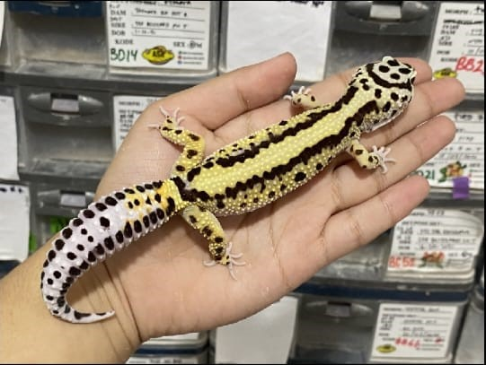
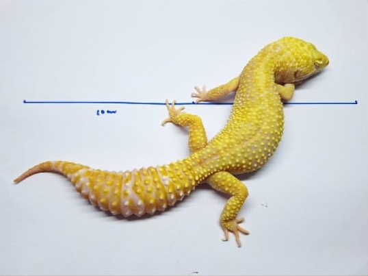
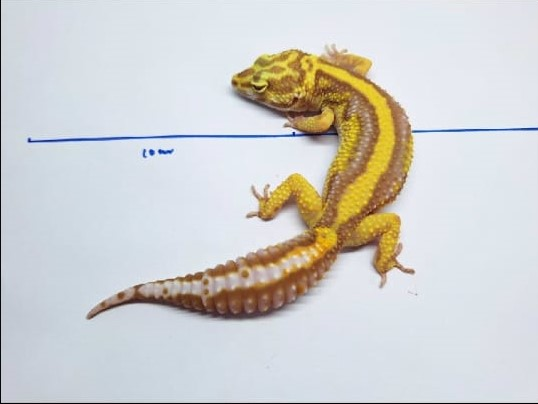
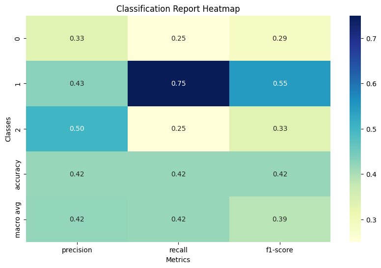
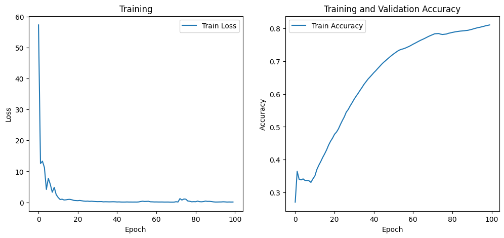

# 🦎 Morph Leopard Gecko Classification with Transformer

This project is a deep learning-based image classification model that aims to classify **Leopard Gecko morphs** using a **Transformer-based model**. The morphs are different visual patterns commonly found in Leopard Geckos.

---

## 📌 Project Description

- This model classifies images of Leopard Geckos into 3 morph categories:
  - `Boldstripe`
  - `Albino`
  - `Albino Boldstripe`
- Dataset consists of ~60 images collected manually from the internet.
- The model is built using a Transformer architecture.
- Dataset is split into training and testing sets.
- The model is trained for 100 epochs.
- Achieved testing accuracy: **41%**

---

## 🗂️ Dataset

- ✅ Total Images: ~60
- ✅ Classes:
  - `Boldstripe`
    
  - `Albino`
    
  - `Albino Boldstripe`
    
- ✅ Split:
  - `train/`
  - `test/`

## 🧠 Model Architecture

- The model is based on a **Transformer**, customized for image classification.

## 🏋️ Training Details

- Epochs: `100`
- Optimizer: `Adam`
- Loss: `CrossEntropyLoss`
- Input size: (e.g. 300x300 RGB)
- Batch size: (8)

## 🧪 Evaluation Results

- **Test Accuracy**:
  
- **Train Accuracy and Loss**:
  

---

## 👨‍💻 Authors

-Developed by [Karsten Errando](https://www.github.com/sixxkr) – Final Year Informatics Student at Telkom University Purwokerto.
